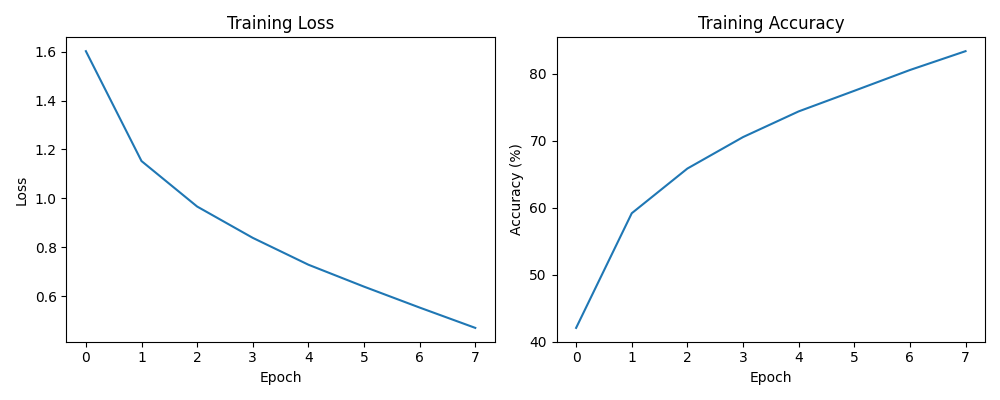
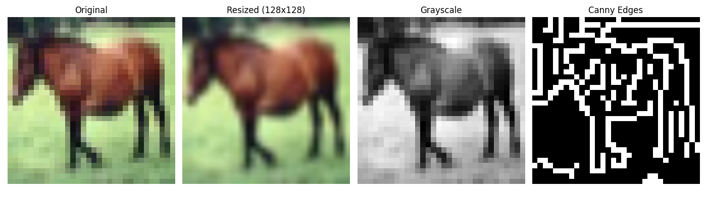

# CIFAR-10 Image Classification: CNN from Scratch vs Transfer Learning

## Overview
This project implements and compares two approaches to image classification on the CIFAR-10 
dataset (60,000 32x32 color images across 10 classes): a Convolutional Neural Network built 
from scratch, and transfer learning using a pretrained ResNet18 model. Built to gain hands-on 
experience with the full PyTorch workflow from data loading through training, evaluation, 
and classical image processing.

## What I Did
- Built a CNN from scratch (2 convolutional layers, max pooling, fully connected layers) 
  and trained it for 8 epochs using cross-entropy loss and SGD.
- Implemented transfer learning using a pretrained ResNet18, freezing the base layers and 
  retraining only the final classification layer for 3 epochs.
- Applied classical OpenCV operations (resizing, grayscale conversion, Canny edge detection) 
  to demonstrate familiarity with traditional computer vision techniques alongside deep learning.
- Compared both approaches directly on the same dataset and test set.

## Results
| Approach | Epochs | Test Accuracy |
|---|---|---|
| CNN from scratch | 8 | 69.81% |
| ResNet18 (transfer learning) | 3 | 80.30% |

## Key Takeaway
Transfer learning achieved significantly higher accuracy with far less training time than 
the from-scratch CNN, demonstrating the practical value of leveraging pretrained models 
rather than always training from zero -- especially relevant when working with smaller 
datasets or limited compute.

## What I'd Improve With More Time
- Add more data augmentation to reduce overfitting on the from-scratch CNN.
- Experiment with fine-tuning more ResNet18 layers (not just the final one) to see if 
  accuracy improves further.
- Try a different architecture (e.g. MobileNet) for a mobile-deployment-focused comparison.

## How to Run
1. Open the notebook in Google Colab.
2. Runtime -> Change runtime type -> select GPU.
3. Run all cells in order -- CIFAR-10 downloads automatically.

## Tech Stack
Python, PyTorch, torchvision, OpenCV, Matplotlib, Google Colab (GPU)
